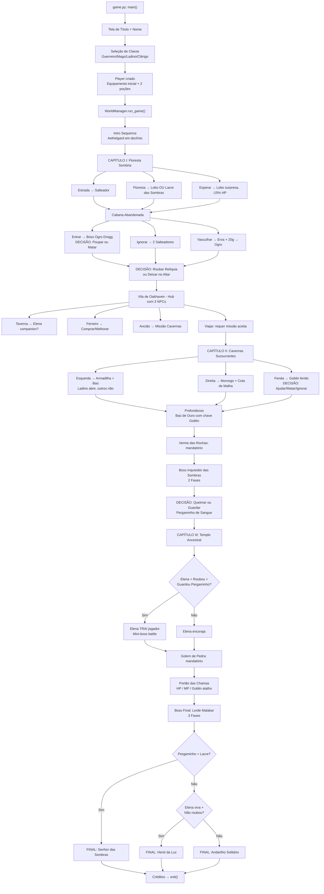

# 🔍 ANÁLISE TÉCNICA COMPLETA — PIKA RPG: CRÔNICAS DE AVENTURA

> Documento gerado após leitura integral de todos os 11 arquivos do projeto (~2.769 linhas, ~125 KB).

---

## ETAPA 1 — LEITURA COMPLETA (Inventário de Arquivos)

| Arquivo | Linhas | Bytes | Responsabilidade |
|---------|--------|-------|------------------|
| [game.py](file:///home/chewbaccaun/Downloads/PIka/game.py) | 81 | 3.7 KB | Ponto de entrada. Tela de título, nome, classe, inicia `WorldManager` |
| [engine/__init__.py](file:///home/chewbaccaun/Downloads/PIka/engine/__init__.py) | 2 | 32 B | Marcador de pacote (vazio) |
| [engine/constants.py](file:///home/chewbaccaun/Downloads/PIka/engine/constants.py) | 92 | 2.4 KB | Cores ANSI, Enums (classe, raridade, tipo de item, efeitos de status), `GAME_CONFIG` |
| [engine/console.py](file:///home/chewbaccaun/Downloads/PIka/engine/console.py) | 145 | 5.7 KB | Funções de UI: caixas, barras, menus, typewriter, clear, SFX texto |
| [engine/art.py](file:///home/chewbaccaun/Downloads/PIka/engine/art.py) | 150 | 5.1 KB | ASCII Arts: Título, Floresta, Cabana, Vila, Cavernas, Templo, Ogro, Inquisidor, Malakar, Game Over, Vitória |
| [engine/items.py](file:///home/chewbaccaun/Downloads/PIka/engine/items.py) | 133 | 7.0 KB | Dataclasses `Item`, `Weapon`, `Armor`, `Consumable`, biblioteca de itens, loot aleatório |
| [engine/player.py](file:///home/chewbaccaun/Downloads/PIka/engine/player.py) | 332 | 13.4 KB | Classe `Player`: stats, level-up, habilidades por classe, equipamento, take_damage, inventário |
| [engine/enemy.py](file:///home/chewbaccaun/Downloads/PIka/engine/enemy.py) | 321 | 14.9 KB | Classe `Enemy`: 7 tipos de IA, 3 bosses multifásicos, biblioteca de inimigos, `spawn_enemy()` |
| [engine/npc.py](file:///home/chewbaccaun/Downloads/PIka/engine/npc.py) | 191 | 9.2 KB | NPCs: `Blacksmith` (loja), `TavernKeeper` (consumíveis/descanso), `ElderAlistair` (missão) |
| [engine/combat.py](file:///home/chewbaccaun/Downloads/PIka/engine/combat.py) | 544 | 24.9 KB | `CombatSystem`: loop de turno, UI de combate, efeitos, habilidades, companheiros, recompensas |
| [engine/world.py](file:///home/chewbaccaun/Downloads/PIka/engine/world.py) | 778 | 38.7 KB | `WorldManager`: narrativa, capítulos 1-3, decisões, companheiros, 3 finais, créditos |

**Total: 2.769 linhas de código Python em 11 arquivos.**

---

## ETAPA 2 — MAPEAMENTO DE MÓDULOS

### 2.1 — `constants.py` (Fundação)

**Responsabilidade**: Define todas as constantes compartilhadas do projeto.

**Depende de**: Nada (módulo raiz).

**Quem depende dele**: Todos os outros módulos.

**Classes/Enums fornecidos**:
- `Colors` — códigos ANSI para terminal (foreground + background + formatação)
- `CharacterClass` — `GUERREIRO`, `MAGO`, `LADINO`, `CLERIGO`
- `Rarity` — `COMUM`, `RARO`, `EPICO`, `LENDARIO` (com `.name_str` e `.color`)
- `ItemType` — `ARMA`, `ARMADURA`, `CONSUMIVEL`, `QUEST`
- `StatusEffect` — 7 efeitos com `.name_str`, `.color`, `.desc`:
  - `ENVENENADO`, `QUEIMADO`, `SANGRAMENTO`, `ATORDOADO`, `FURIA`, `ESCUDO_ARCANO`, `PROTEGIDO`
- `GAME_CONFIG` — dicionário com `BASE_XP_LEVEL=100`, `XP_MULTIPLIER=1.5`, `MAX_LEVEL=20`, `DEFAULT_MAX_HP=100`, `DEFAULT_MAX_MP=50`

**Pontos de expansão**: Novas classes, raridades, tipos de item, efeitos de status.

> [!NOTE]
> O `GAME_CONFIG` usa `dict` em vez de constantes nomeadas, reduzindo legibilidade e autocomplete do IDE.

---

### 2.2 — `console.py` (Camada de Apresentação)

**Responsabilidade**: Todas as funções de renderização e interação com o terminal.

**Depende de**: `constants.py`

**Quem depende dele**: `combat.py`, `world.py`, `npc.py`, `game.py`

**Funções fornecidas**:
| Função | Descrição |
|--------|-----------|
| `clear_screen()` | Limpa terminal (cross-platform via `os.system`) |
| `print_divider()` | Divisor horizontal estilizado |
| `print_centered()` | Texto centralizado com cores |
| `remove_ansi()` | Strip de escape codes ANSI para calcular largura real |
| `typewriter()` | Efeito de digitação caractere por caractere |
| `play_sound_effect()` | Efeito sonoro textual com emojis e pausa |
| `draw_box()` | Caixa ASCII com título e linhas alinhadas |
| `draw_two_columns()` | Duas caixas lado a lado (combate: status + logs) |
| `make_bar()` | Barra visual de progresso (HP/MP/XP) |
| `get_menu_choice()` | Menu com validação de input |
| `press_any_key()` | Pausa até ENTER |

> [!WARNING]
> `remove_ansi()` importa `re` **dentro** da função a cada chamada (linha 22) — deveria ser importação no topo do arquivo.

---

### 2.3 — `art.py` (Assets Visuais)

**Responsabilidade**: Todas as ASCII Arts do jogo.

**Depende de**: `constants.py` (cores)

**Quem depende dele**: `combat.py`, `world.py`, `game.py`

**Assets**: `TITLE_ART`, `FOREST_ART`, `CABIN_ART`, `TOWN_ART`, `CAVES_ART`, `TEMPLE_ART`, `OGRE_ART`, `INQUISITOR_ART`, `MALAKAR_ART`, `GAME_OVER_ART`, `VICTORY_ART`

**Funções**: `print_art()` — helper para exibir arte com padding

> [!NOTE]
> A função `print_art()` é **código morto** — nunca é chamada. `import time` (linha 1) também nunca é usado.

---

### 2.4 — `items.py` (Sistema de Itens)

**Responsabilidade**: Definição das classes de itens e catálogo completo.

**Depende de**: `constants.py`

**Quem depende dele**: `player.py`, `combat.py`, `npc.py`, `world.py`

**Classes fornecidas**:
- `Item` (dataclass base) — `name`, `item_type`, `rarity`, `description`, `value`, `get_colored_name()`
- `Weapon(Item)` — `attack_power`, `durability`, `max_durability`
- `Armor(Item)` — `defense_power`, `durability`, `max_durability`
- `Consumable(Item)` — `heal_hp`, `heal_mp`, `stat_boost_type/amount`, `purge_status` + método `use(target)`

**Dados**: `ITEMS_LIBRARY` — 23 itens registrados (11 armas, 5 armaduras, 7 consumíveis).

**Funções**: `create_item(id)` e `get_random_loot(level)`

> [!IMPORTANT]
> O sistema de **durabilidade** (`durability`, `max_durability`) existe nos dataclasses de `Weapon` e `Armor` mas **nunca é usado** — código morto. Imports `Dict`, `Any` de `typing` também nunca são usados no módulo.

---

### 2.5 — `player.py` (Entidade do Jogador)

**Responsabilidade**: Definição completa do jogador e todas suas mecânicas.

**Depende de**: `constants.py`, `items.py`

**Quem depende dele**: `combat.py`, `world.py`, `npc.py`, `game.py`

**Classe `Player`**:
- **Stats**: `forca`, `inteligencia`, `agilidade`, `vitalidade`
- **Recursos**: `hp`/`max_hp`, `mp`/`max_mp`, `xp`, `gold`, `level`
- **Equipamento**: `weapon: Optional[Weapon]`, `armor: Optional[Armor]`
- **Inventário**: `List[Item]`
- **Companheiro**: `Optional[str]` (apenas um nome, ex: `"Elena"`)
- **Decisões**: `Dict[str, Any]` chamado `choices`
- **Efeitos**: `Dict[StatusEffect, int]`

**Métodos importantes**:
| Método | Descrição |
|--------|-----------|
| `setup_class_stats()` | Atributos iniciais por classe |
| `equip_starting_gear()` | Equipamento e poções iniciais |
| `get_attack_power()` | `weapon_atk + (forca//2 OU inteligencia//2 para Mago)` |
| `get_defense_power()` | `armor_def + vitalidade//3` |
| `gain_xp()` | Progressão com level-up automático e cura total |
| `take_damage()` | Esquiva → Bloco → Defesa → Escudo Arcano → HP loss |
| `get_skills()` | 3 habilidades por classe (níveis 1, 3, 6) retornadas como `List[Dict]` |
| `show_status()` | Formatação de painel de status |

> [!WARNING]
> `show_status()` é **código morto** — definido (28 linhas) mas nunca chamado em nenhum lugar do projeto.

---

### 2.6 — `enemy.py` (Entidades Inimigas + IA)

**Responsabilidade**: Definição de inimigos, comportamentos de IA e bosses multifásicos.

**Depende de**: `constants.py`

**Quem depende dele**: `combat.py`, `world.py`

**Classe `Enemy`**:
- Stats: `name`, `hp/max_hp`, `attack`, `defense`, `xp_reward`, `gold_reward`
- IA: `ai_type: str` (string mágica!), `defending: bool`
- Boss: `phase`, `max_phases`, `transformed`

**7 Comportamentos de IA**:

| Tipo | Comportamento |
|------|---------------|
| `AGGRESSIVE` | 75% ataque normal, 25% pesado (1.4×) |
| `DEFENSIVE` | Defende abaixo de 40% HP (60% chance); senão 30% defesa, 70% ataque cauteloso (0.9×) |
| `CASTER` | 30% Queimadura, 30% Veneno, 40% Projétil de Energia |
| `COWARD` | Cura abaixo de 30%, "foge" abaixo de 15% (nunca executado — **BUG**), ataque fraco (0.8×) |
| `BOSS_OGRE` | Fúria permanente abaixo de 40% HP (+50% ataque, -3 defesa). Golpes variados. |
| `BOSS_INQUISITOR` | Fase 1: Cura/Sombra/Barreira → Fase 2: Demônio com Dreno de Alma/Garras/Onda de Choque |
| `BOSS_MALAKAR` | Fase 1: Invoca Cultistas → Fase 2: Lava/Correntes → Fase 3: Cometa do Apocalipse/Caos |

**Dados**: `ENEMIES_LIBRARY` — 12 inimigos. **3 nunca são usados** (`goblin_caverna`, `xama_goblin`, `demonio_fogo`).

> [!IMPORTANT]
> O `ai_type` é **string mágica** em vez de Enum — propenso a erros de digitação e sem autocomplete.

---

### 2.7 — `combat.py` (Motor de Combate) — **544 linhas**

**Responsabilidade**: Todo o loop de combate por turnos, UI durante batalhas, e distribuição de recompensas.

**Depende de**: `constants.py`, `console.py`, `items.py`, `enemy.py`, `art.py`

**Quem depende dele**: `world.py`

**Classe `CombatSystem`** — métodos principais:
| Método | Descrição |
|--------|-----------|
| `run()` | Loop principal. Retorna `True` (vitória), `False` (derrota) ou `"FLED"` |
| `draw_screen()` | Tela completa: inimigos + ASCII art + duas colunas (status/logs) |
| `player_turn()` | Menu de 5 ações: Atacar, Habilidades, Itens, Defender, Fugir |
| `use_player_skill()` | Executa habilidades via **string matching** (12 `if/elif` com nomes em português) |
| `enemy_turn()` | Processa ação de cada inimigo vivo |
| `companion_action()` | Elena cura/atira flecha; Drogg esmaga |
| `check_boss_transformations()` | Verifica se boss morreu mas tem outra fase |
| `distribute_rewards()` | XP, ouro, loot aleatório |
| `process_player_status_effects()` | DOTs no jogador |
| `process_enemy_status_effects()` | DOTs nos inimigos |

> [!WARNING]
> Imports não utilizados: `print_divider` (importado mas nunca usado), `Weapon`, `Armor` (importados mas nunca usados).

---

### 2.8 — `npc.py` (NPCs e Lojas)

**Responsabilidade**: NPCs interativos com diálogos e lojas.

**Depende de**: `constants.py`, `console.py`, `items.py`

**Quem depende dele**: `world.py`

**Classes**:
- `NPC` (base) — `name`, `description`, `interact(player)` (método vazio)
- `Blacksmith` — Loja de armas/armaduras + melhoria de arma (+4 ataque, 35g)
- `TavernKeeper` — Poções, descanso (cura total, 15g), boatos narrativos
- `ElderAlistair` — Diálogos ramificados baseados em `player.choices`, dá missão das cavernas

> [!NOTE]
> Imports `Consumable`, `Weapon`, `Armor` em `npc.py` são **totalmente não utilizados**.

---

### 2.9 — `world.py` (Narrativa e Fluxo do Jogo) — **778 linhas, O MAIOR ARQUIVO**

**Responsabilidade**: Todo o fluxo narrativo, capítulos, decisões, finais.

**Depende de**: TODOS os outros módulos (importa 10 módulos).

**Quem depende dele**: `game.py`

**Classe `WorldManager`** com ~30 métodos gerenciando cenas individuais.

> [!CAUTION]
> **BUG CRÍTICO**: `print_centered` é usada **17 vezes** mas **NÃO ESTÁ IMPORTADA** em [world.py:4-6](file:///home/chewbaccaun/Downloads/PIka/engine/world.py#L4-L6). O jogo **crasha com `NameError`** assim que o Capítulo 1 inicia (linha 48).

---

### 2.10 — `game.py` (Ponto de Entrada)

**Responsabilidade**: Bootstrap, seleção de nome e classe.

**Depende de**: `constants.py`, `console.py`, `art.py`, `player.py`, `world.py`

**Funções**: `main()`, `print_divider_simple()`

> [!NOTE]
> `print_divider_simple()` duplica a funcionalidade de `print_divider()` de `console.py`.

---

## ETAPA 3 — FLUXO DO JOGO (Jornada Completa)

### Decisões-chave que alteram a narrativa:

| Decisão | Flag em `choices` | Consequência |
|---------|-------------------|--------------|
| Pegar Lacre das Sombras (Floresta) | `lacre_sombrio` | Habilita Final Sombrio |
| Poupar o Ogro Drogg | `poupou_ogro` | Drogg vira companheiro no Boss Final |
| Roubar Relíquia da Cabana | `roubou_cabana` | Elena desconfia; Alistair comenta; possível traição |
| Resposta a Elena (3 diálogos) | `elena_confronted`, `inimiga_elena` | Elena companheira ou hostil |
| Honestidade sobre roubo p/ Elena | — | Elena aceita com raiva ou te rejeita permanentemente |
| Ajudar Goblin Dropp | `ajudou_goblin`, `chave_caves` | Chave do baú épico + atalho gratuito no Capítulo 3 |
| Guardar Pergaminho de Sangue | `guardou_pergaminho` | Elena trai + Final Sombrio habilitado |
| Queimar Pergaminho | `queimou_pergaminho` | Caminho limpo |

---

## ETAPA 4 — MECÂNICAS DETALHADAS

### 4.1 — Sistema de Combate

Combate por **turnos alternados**: jogador → inimigos → companheiro.

**Turno do jogador** (5 ações):
1. **Atacar** — dano = `get_attack_power() × random(0.8, 1.2)`, chance de crítico (base 5%, Ladino +1.5%×agilidade), crítico = 1.8×
2. **Habilidades** — gasta MP, efeitos específicos por nome (string matching)
3. **Itens** — consome `Consumable` do inventário
4. **Defender** — aplica `PROTEGIDO` por 1 turno (50% mitigação)
5. **Fugir** — chance = `40% + agilidade×2%`, falha = turno perdido

**Dano recebido pelo jogador** (`take_damage`):
1. Esquiva: `min(40%, agilidade×2%)`
2. Bloco: se `PROTEGIDO`, 50% redução
3. Defesa: subtrai `get_defense_power()` (`armor_def + vitalidade÷3`)
4. Escudo Arcano: absorve dano restante até quebrar
5. Mínimo: 1 de dano (exceto se esquivou)

**Dano recebido pelo inimigo** (`take_damage`):
- Mitigação = `defense` (× 1.5 + 5 se defendendo)
- Mínimo: 1 de dano

**DOTs** processados antes do turno do jogador:
- Veneno: 8% HP máximo por turno
- Queimadura: 6% HP máximo por turno
- Sangramento: 10% HP máximo por turno

> [!WARNING]
> **Problema de balanceamento**: A descrição de `QUEIMADO` diz "Causa dano **e reduz ataque**" mas a redução de ataque **nunca é implementada**. Apenas causa dano.

### 4.2 — IA dos Inimigos

Cada tipo de IA possui uma **árvore de decisão** baseada em `random.random()` e `hp/max_hp`:

| Tipo | Comportamento detalhado |
|------|-------------------------|
| `AGGRESSIVE` | `random < 0.25` → pesado (1.4×); `else` → normal |
| `DEFENSIVE` | `hp < 40% e random < 0.6` → defesa; `random < 0.3` → defesa; `else` → ataque cauteloso (0.9×) |
| `CASTER` | `< 0.3` → Queimadura; `< 0.6` → Veneno; `else` → Projétil |
| `COWARD` | `hp < 0.3` → cura (30% max_hp); `hp < 0.15` → **NUNCA EXECUTA** (BUG); `else` → fraco (0.8×) |
| `BOSS_OGRE` | Fúria permanente `hp < 40%` (+50% atk, -3 def). Em fúria: 40% esmagador (1.6×), 60% normal. Sem fúria: 30% clava (1.3×), 20% defesa, 50% investida |
| `BOSS_INQUISITOR` | **Fase 1** (120 HP): cura se `hp < 60`, 70% Seta de Sombra, 30% Barreira. **Fase 2** (200 HP): 40% Dreno de Alma (1.2×+heal), 30% Garras com Sangramento, 30% Onda de Choque (1.5×) |
| `BOSS_MALAKAR` | **Fase 1** (180 HP): Invoca Cultista, Fogo, Defesa. **Fase 2** (250 HP): 40% Lava com Queimadura (1.3×), 60% Correntes. **Fase 3** (300 HP): 30% Cometa (1.8×), 30% Caos + Stun, 40% Fúria sequencial (1.1×) |

### 4.3 — Progressão

- **XP necessário por nível**: `100 × (nível ^ 1.5)`
  - Nível 1→2: **100 XP** | Nível 3→4: **520 XP** | Nível 5→6: **1.118 XP** | Nível 10→11: **3.162 XP**
- **Level-up**: cura total + boost de stats por classe
- **Nível máximo**: 20
- **Habilidades desbloqueadas**: Nível 1, 3 e 6 (apenas 3 por classe)

### 4.4 — Inventário e Equipamento

- Inventário: `List[Item]` simples, **sem limite de capacidade**
- Equipamento: apenas 1 arma e 1 armadura por vez
- Ao equipar item novo, o antigo volta ao inventário
- **Não há sistema de venda** de itens pelo jogador
- **Não há menu de inventário** fora de combate

### 4.5 — Economia

| Fonte | Valor |
|-------|-------|
| Ouro inicial | 50g |
| Salteador | 25g |
| Ogro | 80g |
| Morcego | 5g |
| Verme | 20g |
| Inquisidor | 150g |
| Malakar | 500g |
| Goblin morto | 45g |
| Cabana vasculhar | 20g |
| **Gastos** | |
| Poção Vida/Mana menor | 5g |
| Descanso | 15g |
| Espada Soldado | 30g |
| Cota de Malha | 50g |
| Melhoria de arma | 35g |

### 4.6 — Sistema de Loot

- **45%** chance de drop por inimigo comum, **100%** para bosses
- Raridade por roll: 65% Comum, 25% Raro, 8% Épico (nível ≥ 5), 2% Lendário (nível ≥ 10)

> [!WARNING]
> `get_random_loot()` instancia **TODOS os itens do catálogo** a cada chamada para filtrar por raridade.

### 4.7 — Companheiros

- Representados como `Optional[str]` — **apenas um nome**
- Elena: cura se HP < 45%, senão atira flecha (dano `12 + level×2`)
- Drogg: esmaga inimigo aleatório (dano `20 + level×3`)
- **Sem stats, HP, ou mortalidade próprios**

### 4.8 — Mecânicas Incompletas ou Ausentes

| Mecânica | Status |
|----------|--------|
| Durabilidade de equipamento | Campos existem, lógica ausente |
| Venda de itens | Não implementado |
| Equipar itens fora de loja | Não implementado |
| Menu de inventário/status fora de combate | Não implementado |
| Save/Load do jogo | Não implementado |
| Eventos aleatórios | Implementação mínima (Floresta 50/50) |
| New Game+ | Não implementado |

---

## ETAPA 5 — DIAGNÓSTICO TÉCNICO

### ✅ Pontos Fortes

1. **Arquitetura modular**: Separação clara entre UI, dados, entidades, combate, narrativa e NPCs
2. **Sistema de decisões com consequências reais**: Flags verificadas em múltiplos pontos (Elena, Alistair, Cap.3, finais)
3. **IA variada**: 7 comportamentos distintos com árvores de decisão diferentes
4. **Bosses multifásicos**: Inquisidor (2 fases) e Malakar (3 fases) com mecânicas únicas
5. **Interface visual cuidada**: Caixas ASCII, barras, duas colunas, typewriter
6. **Uso de dataclasses**: Itens bem estruturados
7. **Validação de input**: `get_menu_choice()` garante opções válidas
8. **4 classes jogáveis** com habilidades distintas
9. **3 finais narrativos** dependentes de múltiplas decisões combinadas
10. **Loot por raridade**: Sistema de cores e probabilidade baseada no nível

### ❌ Pontos Fracos

#### Arquitetura
- `world.py` é um **"God Object"** (778 linhas, ~30 métodos, depende de TUDO)
- A **luta do Ogro duplica o loop de combate inteiro** (linhas 182-228 de `world.py`) em vez de estender `CombatSystem`
- NPCs são **re-instanciados a cada visita** sem estado persistente
- Companheiro é **apenas uma string** em vez de entidade com stats
- Skills são **dicionários** com string matching no nome — frágil e sem polimorfismo

#### Organização
- **String matching para habilidades** (`if skill["name"] == "Golpe Poderoso"`) — propenso a erro
- **String matching para tipo de IA** (`ai_type` é `str` em vez de Enum)
- **Detecção de boss por substring do nome** (`"Ogro" in enemy.name`) — quebra se o nome mudar

#### Erros de Português
- `"Atornado"` → deveria ser `"Atordoado"` ([constants.py:67](file:///home/chewbaccaun/Downloads/PIka/engine/constants.py#L67))
- `"O SEGREDOS DO RITUAL"` → deveria ser `"OS SEGREDOS DO RITUAL"` ([world.py:587](file:///home/chewbaccaun/Downloads/PIka/engine/world.py#L587))
- `"O OGRO SE COVARA"` → deveria ser `"O OGRO SE ACOVARDA"` ([world.py:189](file:///home/chewbaccaun/Downloads/PIka/engine/world.py#L189))

#### Balanceamento
- XP escala `100 × nível^1.5` mas há apenas ~8-10 combates por playthrough → jogador provavelmente nunca passa do nível 3-4 → habilidades de nível 6 **quase inacessíveis**
- Combate customizado do Ogro em `world.py` não processa stun nem atualiza tela consistentemente

#### Escalabilidade
- Capítulos são **hardcoded** como métodos sequenciais
- **Sem sistema de quest data-driven** — missões são código procedural inline
- **Sem sistema de save/load** — impossível retomar o jogo
- **Sem serialização de estado**

#### Experiência do Jogador
- **Sem menu de inventário** fora de combate
- **Typewriter sem skip** — não há como pular delays
- Oakhaven pode se tornar **beco sem saída** se recusar missão repetidamente
- `exit()` chamado diretamente sem confirmação

---

## ETAPA 6 — RISCOS

### 🐛 Bugs

| # | Severidade | Arquivo | Descrição |
|---|-----------|---------|-----------|
| 1 | **CRÍTICO** | [world.py:4-6](file:///home/chewbaccaun/Downloads/PIka/engine/world.py#L4-L6) | `print_centered` usada 17 vezes mas **não importada**. `NameError` ao iniciar Capítulo 1 (linha 48). **O jogo não funciona.** |
| 2 | **ALTO** | [enemy.py:131-139](file:///home/chewbaccaun/Downloads/PIka/engine/enemy.py#L131-L139) | IA `COWARD`: check de fuga (`hp < 0.15`, linha 136) **NUNCA executa** porque o check de cura (`hp < 0.3`, linha 131) já retorna antes. O inimigo nunca foge. |
| 3 | **ALTO** | [combat.py:281-288](file:///home/chewbaccaun/Downloads/PIka/engine/combat.py#L281-L288) | `select_enemy_target()` indexa lista completa `self.enemies[int(choice)-1]` mas gera opções filtrando `is_alive()`, podendo selecionar inimigo morto. |
| 4 | **MÉDIO** | [constants.py:67](file:///home/chewbaccaun/Downloads/PIka/engine/constants.py#L67) | Typo: `"Atornado"` → deveria ser `"Atordoado"`. |
| 5 | **MÉDIO** | [world.py:587](file:///home/chewbaccaun/Downloads/PIka/engine/world.py#L587) | `"O SEGREDOS DO RITUAL"` → `"OS SEGREDOS DO RITUAL"` |
| 6 | **MÉDIO** | [world.py:189](file:///home/chewbaccaun/Downloads/PIka/engine/world.py#L189) | `"O OGRO SE COVARA"` → `"O OGRO SE ACOVARDA"` |
| 7 | **BAIXO** | [world.py:233](file:///home/chewbaccaun/Downloads/PIka/engine/world.py#L233) | Se o jogador mata o ogro antes de 20% HP, `poupou_ogro` nunca é setado — semântica acidental (retorna `None` que é falsy). |

### 🔒 Soft-Locks Potenciais

| # | Descrição |
|---|-----------|
| 1 | **Oakhaven sem missão**: Se o jogador recusar a missão repetidamente (opção 3 do Alistair), ele fica em loop infinito na vila. `visit_oakhaven()` usa **recursão** (chama a si mesma), o que pode causar `RecursionError` em sessions longas. |

### 💀 Código Morto

| Item | Localização |
|------|-------------|
| `print_art()` | [art.py:144-149](file:///home/chewbaccaun/Downloads/PIka/engine/art.py#L144-L149) — definida, nunca chamada |
| `import time` | [art.py:1](file:///home/chewbaccaun/Downloads/PIka/engine/art.py#L1) — importado, nunca usado |
| `show_status()` | [player.py:304-331](file:///home/chewbaccaun/Downloads/PIka/engine/player.py#L304-L331) — 28 linhas mortas |
| `print_divider` import | [combat.py:6](file:///home/chewbaccaun/Downloads/PIka/engine/combat.py#L6) — importada, nunca usada |
| `Weapon`, `Armor` imports | [combat.py:9](file:///home/chewbaccaun/Downloads/PIka/engine/combat.py#L9) — importados, nunca usados |
| `Consumable`, `Weapon`, `Armor` imports | [npc.py:5](file:///home/chewbaccaun/Downloads/PIka/engine/npc.py#L5) — importados, nunca usados |
| `StatusEffect` import | [world.py:3](file:///home/chewbaccaun/Downloads/PIka/engine/world.py#L3) — importado, nunca usado |
| `get_random_loot` import | [world.py:7](file:///home/chewbaccaun/Downloads/PIka/engine/world.py#L7) — importado, nunca usado |
| `Enemy` import | [world.py:8](file:///home/chewbaccaun/Downloads/PIka/engine/world.py#L8) — importado, nunca usado diretamente (usa `spawn_enemy`) |
| `durability` / `max_durability` | [items.py:20-21](file:///home/chewbaccaun/Downloads/PIka/engine/items.py#L20-L21), [items.py:26-27](file:///home/chewbaccaun/Downloads/PIka/engine/items.py#L26-L27) — campos mortos |
| `Dict`, `Any` imports | [items.py:3](file:///home/chewbaccaun/Downloads/PIka/engine/items.py#L3) — nunca usados |
| `DEFAULT_MAX_HP/MP` | [constants.py:89-90](file:///home/chewbaccaun/Downloads/PIka/engine/constants.py#L89-L90) — nunca lidos |
| 3 inimigos no catálogo | [enemy.py:301-311](file:///home/chewbaccaun/Downloads/PIka/engine/enemy.py#L301-L311) — `goblin_caverna`, `xama_goblin`, `demonio_fogo` nunca spawnam |

### 🔗 Duplicação de Código

| Item | Detalhes |
|------|----------|
| `process_player_status_effects()` e `process_enemy_status_effects()` | ~40 linhas de lógica quase idêntica |
| `print_divider_simple()` em `game.py` | Duplica `print_divider()` de `console.py` |
| Loop do Ogro em `world.py` (linhas 182-228) | Duplica parcialmente `CombatSystem.run()` |

### ⚠️ Acoplamento Excessivo

| Problema | Detalhes |
|----------|----------|
| `enemy.py` modifica `player.status_effects` diretamente | Viola encapsulamento (ex: [enemy.py:117](file:///home/chewbaccaun/Downloads/PIka/engine/enemy.py#L117)) |
| `combat.py` conhece nomes de habilidades | String matching em 12 nomes cria acoplamento rígido |
| `combat.py` detecta bosses por nome | `"Ogro" in enemy.name` — acoplamento frágil |
| `world.py` depende de TODOS os módulos | 10 imports — responsabilidade excessiva |

---

## ETAPA 7 — PLANO DE EVOLUÇÃO

### Fase 1 — Correções Críticas (Prioridade Máxima)
> Sem estas correções, o jogo **não funciona**.

1. **Corrigir import de `print_centered`** em `world.py` — crash na linha 48
2. **Corrigir bug da IA Coward** — reordenar: fuga (`< 0.15`) ANTES de cura (`< 0.3`)
3. **Corrigir `select_enemy_target()`** — mapear corretamente inimigos vivos
4. **Corrigir typos** — `"Atornado"` → `"Atordoado"`, `"SEGREDOS"` → `"OS SEGREDOS"`, `"COVARA"` → `"ACOVARDA"`
5. **Remover imports e código morto** de todos os módulos

### Fase 2 — Melhorias Arquiteturais
> Preparar para expansão futura.

1. **Converter `ai_type` de string para Enum** (`AIType`)
2. **Criar classe `Companion`** com stats, HP e comportamento (substituindo `Optional[str]`)
3. **Extrair habilidades** de string-matching para dicionários com dispatch por ID
4. **Extrair loop do Ogro** — usar hook/callback no `CombatSystem` (ex: `on_enemy_low_hp`)
5. **Unificar `process_status_effects`** em função genérica
6. **Mover `re.compile` para escopo de módulo** em `console.py`
7. **Converter recursão `visit_oakhaven`** para loop `while True`

### Fase 3 — Novos Sistemas
> Funcionalidades fundamentais ausentes.

1. **Menu de Inventário/Status fora de combate** — ver itens, equipar, ver status
2. **Sistema de Save/Load** — serializar `Player` via JSON
3. **Skip de typewriter** — pular animação de texto
4. **Implementar redução de ataque por Queimadura** conforme descrição
5. **Implementar ou remover durabilidade** de equipamentos
6. **Sistema de venda de itens** no Ferreiro

### Fase 4 — Polimento
> Elevar qualidade da experiência.

1. **Rebalancear XP** — curva mais suave para nível 5-6 ao final do jogo
2. **Usar os 3 inimigos não-utilizados** como encontros nos capítulos
3. **Adicionar encontros aleatórios** entre cenas fixas
4. **Resumo de escolhas** no final antes dos créditos
5. **Tela de status pós-nível** com detalhes dos ganhos
6. **Tutorial** ao combate no primeiro encontro
7. **Boss art via campo `art_key`** em vez de substring do nome

### Fase 5 — Expansão de Conteúdo
> Crescimento do jogo com conteúdo novo.

1. **Novas classes** (Ranger, Necromante) — `CharacterClass` e `get_skills()` suportam
2. **Novos capítulos** — sistema modular permitirá adicionar
3. **Novas cidades** — expandir padrão de Oakhaven
4. **Novos itens** — `ITEMS_LIBRARY` facilmente expansível
5. **Boss secreto** — acessível apenas com decisões específicas
6. **New Game+** — stats mantidos, inimigos mais fortes
7. **Sistema de reputação** — substituir flags booleanas por alinhamento numérico
8. **Mais ASCII arts** para ambientes e inimigos
