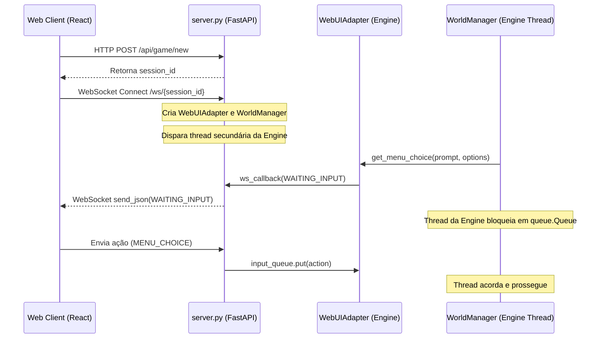

# Plano de Refatoração Arquitetural — PIKA RPG (Aethelgard)

Este documento define a estratégia detalhada de refatoração para transformar a base de código herdada de um jogo CLI de console para uma arquitetura distribuída, robusta, escalável e preparada para múltiplos jogadores simultâneos.

---

## 1. Executive Summary

O projeto atual sofre de **débito técnico estrutural** decorrente de sua evolução híbrida. Nascido como um RPG de terminal síncrono, ele foi adaptado para a Web através de uma "ponte de threads" que bloqueia a execução da engine simulando chamadas de `input()`. 

Embora o jogo funcione para uma sessão única isolada, a arquitetura atual possui limitadores severos de escalabilidade e concorrência:
1. **Concorrência Inviável**: Adaptadores globais (`UIAdapter._instance`) causam colisões imediatas caso dois jogadores se conectem simultaneamente.
2. **Abstração Acoplada**: Lógica de renderização de console (`draw_box`, `clear_screen`) é ativamente executada na thread da engine, mesmo quando o cliente está na Web.
3. **Persistência Global**: Salvamentos residem em um único arquivo `savegame.json`, impedindo sessões independentes.
4. **Instabilidade de Conexão**: Uma desconexão WebSocket mata a thread de jogo de forma destrutiva, resultando em perda de progresso narrativo caso a reconexão ocorra.

Este plano propõe desvincular a engine das amarras do terminal clássico, transformando o backend em um **servidor de estado autoritativo não-bloqueante** (ou gerenciado de forma assíncrona por sessão), onde o cliente web atua puramente como uma camada de visualização reativa (view-only renderer).

---

## 2. Current Architecture

A arquitetura atual funciona conforme ilustrado abaixo:



### Detalhes de Implementação Existentes
- **Thread por Sessão**: Cada conexão de WebSocket cria uma thread do sistema operacional executando `world.run_game()`.
- **Adaptadores Estáticos**: `UIAdapter` expõe um método de classe `set_instance` e `get_instance` que atua como um Singleton estático.
- **Acoplamento de Prints**: Módulos como `console.py` usam um ThreadLocal (`WebBridgeStorage`) para desviar as saídas do stdout do console para o WebSocket correspondente à thread atual.
- **Máquina de Estado de Combate**: O `CombatSystem` gerencia turnos em fases (`CombatPhase`) e delega as decisões ao `CombatUI`, que simula escolhas bloqueantes de menu.

---

## 3. Architectural Problems & Multiplayer Blockers

### 🔴 Blocker 1: Estado Global de Adaptadores (Race Conditions de Concorrência)
O método `UIAdapter.set_instance(adapter)` define o adaptador de entrada globalmente na classe:
```python
@classmethod
def set_instance(cls, instance):
    cls._instance = instance
```
Quando o jogador B se conectar enquanto o jogador A está ativo, `UIAdapter.set_instance` substituirá a referência global. A partir desse momento, as consultas de input feitas pela thread do jogador A serão direcionadas para a fila de input do jogador B, misturando completamente as sessões.

### 🔴 Blocker 2: Persistência de Arquivo Único
O módulo `save_system.py` manipula estaticamente a string `"savegame.json"`. Não há escopo de usuário, conta ou identificador de sessão associado ao arquivo. Dois usuários tentando salvar ou carregar seus estados sobrescreverão o mesmo arquivo físico.

### 🟡 Blocker 3: Perda de Contexto Narrativo na Desconexão
Se o canal WebSocket cai (ex: perda temporária de sinal de rede), o `WebSocketDisconnect` é capturado em `server.py`, ativando a flag `adapter.shutdown_event.set()`. A thread da engine captura esse sinal na próxima verificação de fila e lança `EngineShutdownException`, finalizando a thread imediatamente. O estado de jogo volátil na memória é perdido e o jogador deve começar do zero.

### 🟡 Blocker 4: Poluição de Saídas de Terminal
A engine gasta ciclos executando lógicas de formatação de string complexas como `draw_two_columns`, `make_bar` e limpando telas (`clear_screen`) que são redundantes para a interface React, a qual reconstrói esses componentes usando HTML/CSS estruturado.

---

## 4. Proposed Architecture

A arquitetura refatorada visa isolar completamente as responsabilidades através de uma separação estrita de camadas.

```
┌────────────────────────────────────────────────────────────────────────┐
│                        WEB CLIENT (React / Vite)                       │
│  - Renderização Pura e Reativa (UI)      - Armazenamento de Assets     │
│  - WebSocket Client                     - Efeitos Sonoros / Estilos    │
└──────────────────────────────────┬─────────────────────────────────────┘
                                   │ (Events & Action DTOs)
                                   ▼
┌────────────────────────────────────────────────────────────────────────┐
│                          FASTAPI APP SERVER                            │
│  - SessionRegistry (In-Memory Session Store / Redis Ready)            │
│  - WebSocket Manager (Connection Pooling e Heartbeats)                 │
│  - Persistence Adapter (Salva arquivos por Session ID/User ID)         │
└──────────────────────────────────┬─────────────────────────────────────┘
                                   │ (Context Instantiation)
                                   ▼
┌────────────────────────────────────────────────────────────────────────┐
│                              GAME ENGINE                               │
│  - WorldState & Entity Models (Sem acoplamento de Console/Prints)      │
│  - CombatSystem State Machine (Puro Orientado a Eventos)                │
│  - Context-Aware UI Adapters (Sem propriedades estáticas de classe)     │
└────────────────────────────────────────────────────────────────────────┘
```

### Componentes Chave do Servidor Proposto
1. **`SessionRegistry`**: Dicionário gerenciador que mapeia `session_id` a instâncias ativas de `GameState` e sua thread associada (ou máquina de estado). A desconexão do socket não mata a thread imediatamente; ela entra em suspensão aguardando um período de expiração (grace period).
2. **Context-Aware Adapter**: A engine receberá o adaptador de entrada via injeção de dependência na inicialização do `WorldManager` ou através de armazenamento local seguro a nível de thread (Thread-Local Storage real para todas as referências, não apenas para o Bridge).
3. **Data Transfer Objects (DTOs)**: Substituição de payloads de texto formatado (`BOX`, `TEXT`) por mensagens tipadas contendo metadados brutos (ex: eventos de narrativa, dados de recompensa compostos de XP, ouro e lista de itens).

---

## 5. Migration Strategy

Para evitar quebras generalizadas, a refatoração será executada em **4 fases incrementais**:

### Fase 1: Isolamento de Sessão e Eliminação do Estado Global (Singleton)
- Substituir o singleton `UIAdapter._instance` por injeção de dependência explícita.
- Modificar `WorldManager` para receber e manter a referência ao seu próprio `UIAdapter` e `GameState`.
- Eliminar o uso de `get_adapter()` global em favor de instâncias passadas no construtor de `CombatSystem`, `Shop`, `NPC` e `CombatUI`.

### Fase 2: Modularização da Persistência por Sessão
- Modificar `save_system.py` para aceitar um identificador de sessão (`session_id`).
- Alterar caminhos de salvamento para `saves/save_{session_id}.json`.
- Atualizar rotas de API em `server.py` para passar o identificador apropriado durante requisições de persistência.

### Fase 3: Purificação Visual da Engine (Remoção do Acoplamento de Terminal)
- Desativar a execução de `CombatUI.draw_screen()` e imports de layout de console caso o adaptador ativo seja `WebUIAdapter`.
- Remover as dependências de escape codes ANSI (`constants.py` e `console.py`) das saídas que vão para a web, transmitindo textos puros e payloads estruturados.
- Desacoplar inteiramente o `CombatUI` (Console) do fluxo de combate web, permitindo que a engine envie atualizações brutas de estado de combate diretamente via `sync_state`.

### Fase 4: Graceful Reconnection e Preservação de Sessão
- Alterar o ciclo de vida da thread de jogo em `server.py`.
- No evento de desconexão, manter o estado da sessão ativo em memória por até 5 minutos.
- Caso ocorra nova tentativa de conexão com o mesmo `session_id`, religar o WebSocket de saída à fila de mensagens da thread existente em vez de spawnar uma nova engine.

---

## 6. Dependency Graph (Target State)

```
[server.py]
    │
    ├─► [SessionRegistry]
    │
    └─► [WorldManager]
            │
            ├─► [WebUIAdapter] (Injetado)
            │
            ├─► [GameState]
            │      └─► [Player]
            │             └─► [QuestManager]
            │
            └─► [CombatSystem] (Injetado com o State do WorldManager)
```

---

## 7. File-by-File Impact Analysis

| Arquivo | Impacto | Alteração Proposta |
| :--- | :--- | :--- |
| `server.py` | Alto | Remover binds de adaptador global estático. Implementar `SessionRegistry` e lógica de re-associação de conexão WebSocket. |
| `engine/adapter.py` | Médio | Remover variável de classe `_instance`. Adicionar contexto de inicialização. |
| `engine/world.py` | Médio | Aceitar `adapter` no construtor. Substituir imports globais de `get_adapter()`. |
| `engine/combat.py` | Baixo | Utilizar o adaptador associado ao `GameState` para solicitações de inputs em vez de chamadas globais. |
| `engine/console.py` | Médio | Tornar seguras e limpas as funções de saída. Garantir que seções Web não processem logs formatados de console. |
| `engine/save_system.py`| Médio | Adicionar parâmetro de assinatura de arquivo de salvamento baseado no id do usuário ou sessão. |

---

## 8. Risk Assessment & Regression Control

- **Risco de Travamento no WebSocket**: Modificações no controle de concorrência e injeção de adaptadores podem gerar exceções caso referências de loops assíncronos quebrem.
  *Mitigação*: Testar utilizando o cliente automatizado `run_test_client.py` para garantir que o fluxo de capítulos prossiga até o fim.
- **Risco de Sobrescrita de Saves**: A alteração no formato do save pode quebrar compatibilidade retroativa.
  *Mitigação*: Se nenhum save com o novo formato de sessão for encontrado, adotar fallback seguro para iniciar uma nova jornada limpa.

---

## 9. Testing Strategy

1. **Testes de Concorrência de Sessão**:
   - Desenvolver um script de teste simulando a conexão paralela de dois sockets distintos executando ações independentes ao mesmo tempo. Verificar se os prompts de input de um não interferem nas escolhas do outro.
2. **Testes de Persistência Isolada**:
   - Validar que salvar a sessão `A` cria um arquivo distinct da sessão `B` e que os dados carregados pertencem exclusivamente ao respectivo jogador.
3. **Testes de Reconexão**:
   - Simular queda forçada do socket durante um combate e reconectar na sequência para assegurar que a engine restabelece o fluxo sem reiniciar a narrativa.

---

## 10. Acceptance Criteria

- [ ] A engine de jogo inicializa e roda múltiplos fluxos simultâneos sem vazamento de dados de inputs entre jogadores.
- [ ] Múltiplos saves podem coexistir localmente sem colisões ou sobrescritas mútuas.
- [ ] O código da engine não realiza chamadas estáticas a `get_adapter()` global.
- [ ] Quedas de conexão temporárias no navegador não causam crash na engine nem reiniciam o jogo do usuário caso a reconexão ocorra dentro do grace period.
- [ ] A suíte de testes `pytest tests/` executa e passa 100% sem erros.
